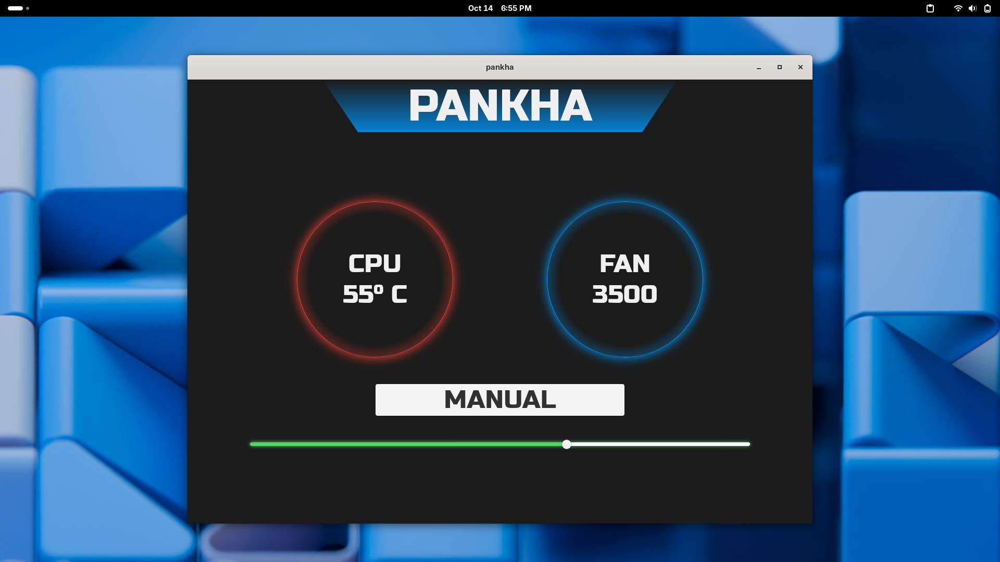

# pankha

A simple GUI utility for controlling and managing fan speed on the `HP OMEN by HP Gaming Laptop 16-wf1xxx`.

> ⚠️ **DISCLAIMER**: This tool is for personal use and has only been tested on **my** device. The `EC registers` are almost certainly different on other laptop models. **Use at your own risk.**

---

## 🖼️ Preview

---

## ⚙️ How It Works

- CPU temperature is detected using the [`lm-sensors`](https://crates.io/crates/lm-sensors) crate.
- It auto-updates every 5 seconds.
- Fan speed is read/controlled via **EC registers**. After reverse-engineering (`ec-dump` + dynamic analysis), the relevant registers are:

### 📚 EC Register Mapping

1. **Register `0x15`**
   
   - Default: `0x00`
   - Function: Controlled by BIOS. Writing a non-zero value (e.g., `0xFF`) switches it to **user-controlled mode**.

2. **Register `0x19`**
   
   - Default: `0xFF`
   - Function: Represents **actual fan speed**.
     - Values are in multiples of 100 RPM.
     - Example: `0x1E` = `3000 RPM`.
     - **Safety limit:** The app restricts speed to a max of **5500 RPM** to avoid fan damage.

---

## 📎 Notes

- Tested only on `HP OMEN 16-wf1xxx` series.
- Requires root privileges due to EC access.

---

## 🛠️ TODO

- [ ] Add installation section
- [ ] Fix crash when app is launched as non-root
- [ ] Feature: auto-adjust fan speed based on temperature

---
